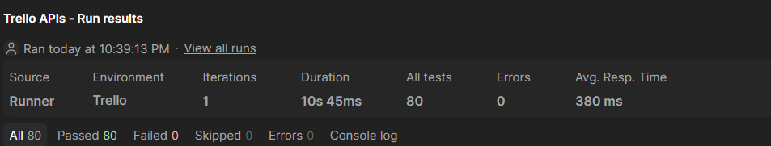

# Trello API Testing Project

Comprehensive API testing of Trello REST API using Postman. Covers full CRUD operations with positive and negative test scenarios.

---

## Project Info

| Item | Details |
|------|---------|
| **API** | Trello REST API v1 |
| **Tool** | Postman |
| **Total Requests** | 23 |
| **Total Assertions** | 40+ |
| **Test Types** | Positive, Negative, Boundary |

---

## Test Coverage

### Positive Tests (Happy Path)

| Feature | Requests | Methods |
|---------|----------|---------|
| Board Management | Create, Get, Update, Delete | POST, GET, PUT, DELETE |
| List Management | Create, Get, Update, Archive | POST, GET, PUT |
| Card Management | Create, Get, Update, Delete | POST, GET, PUT, DELETE |

### Negative Tests (Error Handling)

| Scenario | Expected Status | Test Case |
|----------|-----------------|-----------|
| Missing authentication token | 401 Unauthorized | Create board without token |
| Invalid board ID format | 400 Bad Request | Get board with malformed ID |
| Missing required field | 400 Bad Request | Create card without `idList` |
| Invalid token | 401 Unauthorized | Update board with fake token |
| Deleted resource | 404 Not Found | Get deleted card |

---

## How to Run

### Prerequisites
- Postman installed
- Trello account (free)
- Trello API Key and Token ([Get yours here](https://trello.com/power-ups/admin))

### Setup

1. **Import Collection**
   - File → Import → Select `Trello_APIs.postman_collection.json`

2. **Import Environment**
   - File → Import → Select `Trello_Environment_Template.json`

3. **Set Environment Variables**
   | Variable | Value |
   |----------|-------|
   | `API key` | Your Trello API Key |
   | `Token` | Your Trello API Token |

4. **Run Collection**
   - Select collection → Click **Run** (Collection Runner)
   - Or use Newman: `newman run Trello_APIs.postman_collection.json -e Trello_Environment.json`

---

## Collection Runner Results

---

## Key Techniques Demonstrated

- **Chained Variables**: `boardId` → `ListId` → `CardId` passed between requests
- **Dynamic Data**: Pre-request scripts generate random names to avoid conflicts
- **Data Integrity**: Response fields validated against request data
- **Error Handling**: 400/401/404 responses validated with meaningful messages
- **Performance**: Response time assertions on all requests

---

## Files

| File | Description |
|------|-------------|
| `Trello_APIs.postman_collection.json` | Main Postman collection |
| `Trello_Environment_Template.json` | Environment variables template (no secrets) |

---

## Future Improvements

- [ ] Add Newman CLI execution with HTML reports
- [ ] Integrate with GitHub Actions for CI/CD
- [ ] Add JSON schema validation tests
- [ ] Expand negative tests with boundary value analysis